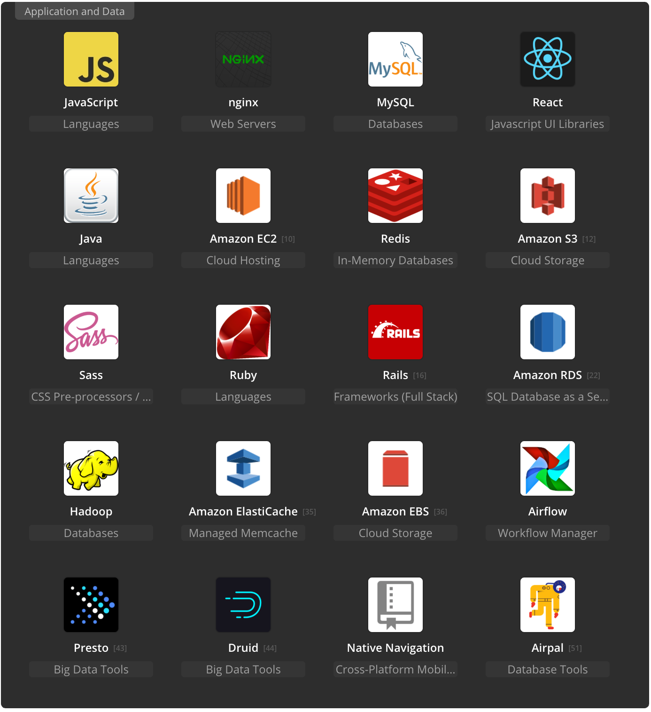

# Skill Stack
	React 기술에 많은 공헌을 하고있는 Airbnb의 스킬 스택 (https://stackshare.io/airbnb/airbnb) 을 기반으로 설계

	
	
	이중 Front-end에서 사용할 것은 
		○ React: view
		○ Webpack: build, test, deploy
		○ Sass: style 작성 - browser spec에 따라 styled-components (https://www.styled-components.com/) 사용 고려
		○ Test: Jest
		○ Enzyme: UI test
		○ Style guide: Airbnb의 Javascript style guide (https://github.com/airbnb/javascript/tree/master/react) 을 기반으로 작성된 typescript style guide (https://github.com/progre/tslint-config-airbnb)
	을 이용할 예정.
	

# 앱의 전체구성

		○ UI React
		○ State Container Redux, Side Effect관리 Redux-saga
		Side Effect 혹은 비동기(asynchronous operations)관리 툴 비교 (https://decembersoft.com/posts/what-is-the-right-way-to-do-asynchronous-operations-in-redux/)
		
		
# 앱 Scaffolding
src	components	-index : interface 정의	-UI component만 작성
		-container: component internal state 관리	-React Component Pattern (https://levelup.gitconnected.com/react-component-patterns-ab1f09be2c82)
		-presenter: stateless component
		-styles
		HOCs(high order component)	UI component를 바탕으로 재작성되는 comopnenet 모음
	scenes	component들의 모임	
		-index : interface 정의, redux store의 관심사 관리
		-container: component internal state 관리
		-presenter: stateless component
		-styles
		
	module	https://github.com/erikras/ducks-modular-redux rule 을 기본으로 구성	Side Effect 가 없는 영역
		Type, Action, Action Creator, reducer, selector 등을 포함
	saga	Reudx-Saga 비동기, Side Effect 관리	일 단위 saga를 Work라는 단위로 분리하고 work 들의 모임을 Flow라고 명명한다.
	shared	앱 전체에서 사용되는 util모음	
	apis	api관리 코드 모음	
	…		

# Routing
	React-route
	https://reacttraining.com/react-router/core/guides/philosophy
	SPA routing 참고글 (https://medium.com/@pshrmn/demystifying-single-page-applications-3068d0555d46)

# Test
	- Unit test
		○ Quokka - Live test (https://quokkajs.com/)
		○ Jest - Facebook 에서 만든 javascript, React test tool
		○ Enzyme(https://airbnb.io/enzyme/) - Airbnb에서 만든 UI test tool
	- End to end test 
		○ Cypress - https://www.cypress.io/

# Component 관리
	- Storybook- Interactive UI component dev & test: React (https://github.com/storybooks/storybook)
	- Bit - Bit works with Git and NPM to improve the workflow around code-sharing. (https://github.com/teambit/bit)

# SSR (server side rendering)
	: react-snapshot 을 이용해 간단한 SSR 구현.
	1. Fire up the home page in a fake browser and snapshot the HTML once the page is rendered
	2. Follow every relative URL to crawl the whole site
	3. Repeat.
# ETC
	- 라이브러리 설치시 버젼 fix를 위해
		○ yarn add <package...> [--exact/-E]
		○ Npm install [-E|--save-exact]
	명령어를 사용하여 설치하는것을 권장

	- pre-commit을 이용하여 스타일 통일
