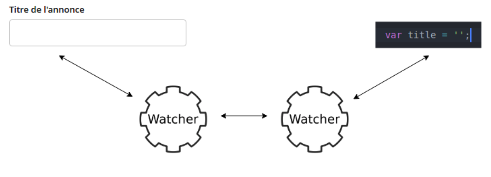
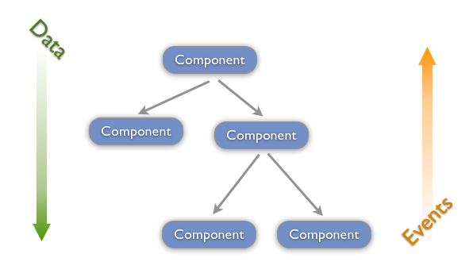
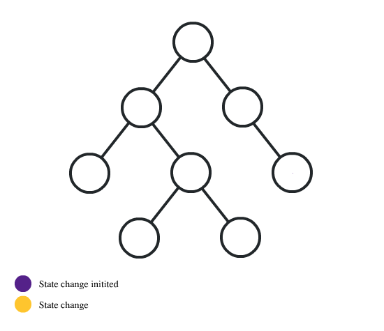

# React: A JavaScript library for building user interfaces
- 단방향 데이터 흐름 지향 (One-way Data Flow)
- 컴포넌트 단위의 관심사 분리
- Virtual DOM

	## 단방향 데이터 흐름
	React.js는 단방향 데이터 흐름을 지향한다. 양방향 데이터 바인딩을 사용할 때처럼 작성할 코드의 양이 확연히 줄거나 하지는 않지만 애플리케이션의 데이터를 관리하는 모델 컴포넌트가 있고 그 데이터를 UI 컴포넌트에 전달하는 단순한 데이터 흐름으로 이해하고 관리하기 쉬운 애플리케이션을 만들 수 있다.

	- Angular

		Angualr 에서는 데이터 바인딩에 2개의 "watcher"를 설치합니다.
		```javascript
		$scope.name = 'test';
		$timeout(function()  { $scope.name = 'another' }, 1000);
		$timeout(function()  { console.log($scope.name); }, 5000);

		<!-- html --->
		<input ng-model="name" />	
		```
		
		`input`은 `test`로 시작한 다음 1000ms마다 `another`으로 업데이트됩니다. controller 코드나 입력을 변경하여 `$scope.name`을 변경하면 4000ms 후에 콘솔 로그에 반영됩니다. 
		`<input />`에 대한 변경 사항은 `$scope.name`에 자동으로 반영됩니다. `ng-model`이 입력을 감시하고 변경 사항의 `$scope`를 알려주기 때문입니다. 코드의 변경 사항과 HTML의 변경 사항은 `양방향 데이터 바인딩`입니다.

		<p align='center'>
		
		</p>


	- React

		React에는 HTML이 구성 요소를 변경할 수있는 메커니즘이 없습니다. HTML은 구성 요소가 응답하는 `event`만 발생시킬 수 있습니다. 전형적인 예로 `onChange`가 있습니다.

		```jvascript
		handleChange(e) {
		  this.setState({value: e.target.value});
		}
		render() { 
		  return <input value={this.state.value} onChange={this.handleChange} />;
		}
		```


		`<input />`의 값은 render 함수에 의해서만 제어됩니다. 이 값을 업데이트하는 유일한 방법은 `Component`에서 onChange 이벤트를 `<input />`에 연결하여 this.state.value를 React 구성 요소 메소드 `setState`로 설정합니다. `<input />`은 `Component State`에 직접 액세스 할 수 없습니다. 또한, `Component State`를 직접 변경 할 수 없습니다. 이것이 `단반향 데이터 바인딩` 입니다.

		<p align='center'>
		
		</p>
		
	- 요약 

		양방향 데이터 바인딩은 코드의 사용면에서 코드량을 크게 줄여주는 등의 장점이 있을 수 있겠지만, 자체 실행 코드 내에서 데이터의 변화를 감지하여 DOM 객체 전체를 렌더링 해주거나, 데이터를 바꿔주는 등의 실행으로 인하여 성능이 감소되는 경우가 생깁니다.

		React는 이러한 양방향 바인딩이 아니기 때문에 실행부 자체 내에서 데이터의 변화를 감지하지 않으며, 데이터에 변화가 오게 되면, 특정 함수를 실행시킴으로써 DOM 객체를 갱신합니다. 따라서, 성능에 관련되어 데이터 변화에 따른 성능 저하 없이 DOM 객체를 갱신해 줄 수 있는 장점이 있습니다.


	## React 수준의 관심사의 분리
	
	기존의 웹 개발 방식은 관심사의 분리보단 마크업, 디자인, 로직을 분리하는 기술의 분리에 가까웠다.
	React는 기존의 방식이 아닌 컴포넌트 형태로 관심사를 분리하도록 하였다.

	<p align='center'>
	
	</p>

	```
	React.js는 컴포넌트로써 마크업과 뷰의 로직을 createClass()의 안에 작성합니다. 하지만 마크업은 HTML으로 뷰의 로직은 자바스크립트로 나눠서 작성하는 기존의 방식을 취하지 않아 마음에 들지 않는 사람도 있을 것 같습니다. 이 대해 React.js의 개발자인 Pete Hunt는 “그것은 관심사의 분리(Separation of concerns)가 아니라 기술의 분리(Speparation of technologies)”라며 마크업과 뷰의 로직은 긴밀해야 한다고 언급했습니다. 거기에 템플릿의 문법으로 불필요하게 코드를 작성하는 것보다 자바스크립트로 작성하는 것이 더 좋다고 말하고 있습니다.
	```

	<p align='center'>
	
	</p>
	
	상위 컴포넌트에서 하위 컴포넌트로만 데이터 이동 가능한 `단방향 데이터 플로우`

	## Virtual DOM

	<p align='center'>
	
	</p>

	### DOM Tree 생성
	1. 브라우저의 렌더 엔진이 HTML 파싱후 DOM Tree 생성
		- Render Tree 생성
	2. 노드 스타일 처리 과정 - attachment
	3. DOM 트리의 노드가 가진 attach 메서드를 통해 스타일 정보를 계산하고 객체 형태로 반환
		- DOM 트리에 새로운 노드가 추가되면 노드의 attach 메서드가 실행 됨
	4. Render Tree 생성시에 각 요소의 스타일 처리과정이 포함되고 다른 요소들의 스타일 속성도 참조
		- Layout(reflow)
	5. 스크린 좌표를 참조하여 표시 위치 결정
		- Painting
	6. 렌더링된 요소에 색을 입히는 과정. 트리의 각 노드들을 거치면서 paint 메서드 호출

	### Vritual DOM은 어떻게 동작하는가?
	<p align='center'>
	
	</p>

	 - react dom diff 알고리즘 https://reactjs-kr.firebaseapp.com/docs/reconciliation.html

	복잡한 SPA(싱글 페이지 어플리케이션) 에서는 DOM 조작이 많이 발생합니다. 그 뜻은 그 변화를 적용하기 위해 브라우저가 많이 연산을 해야한단 소리고, 전체적인 프로세스를 비효율적으로 만듭니다.
	이 부분에서 Virtual DOM의 장점이 두드러집니다 만약에 뷰에 변화가 있다면, 그 변화는 실제 DOM 에 적용되기전에 가상의 DOM 에 먼저 적용시키고 그 최종적인 결과를 실제 DOM 으로 전달해줍니다. 이로써, 브라우저 내에서 발생하는 연산의 양을 줄여 성능이 개선되는 것입니다.

# Redux: A predictable state container for JavaScript apps.

<p align='center'>

</p>

MVC는 확장이 어렵고 거대한 시스템에 어울리지 않는다고 페이스북은 결론을 내렸습니다.

이유는 새로운 기능 추가 시 시스템의 복잡도가 기하 급 수적으로 증가하여 개발자는 기존 기능에 대한 영향을 주지 않을지에 대한 불안감을 주게 됩니다. 모델(Model)과 뷰(View)의 수가 커지고 데이터의 흐름이 양방향으로 이루어질 수록 복잡도는 더욱 증가하고 디버깅 및 코드를 이해하기 어려워지기 때문입니다.

<p align='center'>

</p>

이에 페이스북은 "좀더 예측 가능하도록 코드 구조화"에 대한 목표로 "데이터 흐름이 단방향인 시스템 아키텍처" `Flux`를 제안합니다.


<p align='center'>

</p>

페이스북은 Flux 아키텍처를 발표한 후 Flux에 대한 구현체도 공개했는데, 이 구현체에는 디스패처만 구현되어 있어 완전한 Flux 프레임워크라 부르기엔 다소 무리가 있었습니다. 2015년 ​10월에 발표한 2.1.0 버전에서 스토어를 지원하기 전까지는 사실상 완전한 공식 Flux 구현체가 없던 셈이다. 이 시기에 많은 Flux 구현체들이 나타났는데, 그 중 하나가 Redux입니다.

`React`로만 컴포넌트를 작성한다면 처음시작은 이렇습니다.
<p align='center'>

</p>
문제가 없어보이지만 이후 어플리케이션이 커진다면
<p align='center'>

</p>
이와 같은 형태가 되어 전달하고 싶은 목적 컴포넌트에 전달하기 위해서는 거치지 않아도 되는 많은 컴포넌트들을 거치고 이에 불필요한 동작도 수반됩니다.

이 문제의 해결도 `Redux`의 사용으로 해결 가능합니다.

<p align='center'>

</p>


# 어플리케이션 구성

## Skill Stack
React 기술에 많은 공헌을 하고있는 Airbnb의 스킬 스택 (https://stackshare.io/airbnb/airbnb) 을 기반으로 설계	

<p align='center'>

</p>
이중 Front-end에서 사용할 것은 

- React: View
- Webpack: build, test, deploy
- Sass: style 작성 - browser spec에 따라 styled-components (https://www.styled-components.com/) 사용 고려
- Test: 
	- Jest: Jest is used by Facebook to test all JavaScript code including React applications
	- Enzyme: 
- Enzyme: JavaScript Testing utility for React that makes it easier to assert, manipulate, and traverse your React Components' output.
- Style guide: Airbnb의 Javascript style guide (https://github.com/airbnb/javascript/tree/master/react) 을 기반으로 작성된 typescript style guide (https://github.com/progre/tslint-config-airbnb)을 사용.

### `create-react-app` 으로 기본 뼈대 구성
```sh
npx create-react-app my-app
cd my-app
npm start
```
<p align='center'>

</p>

- UI React
- State Container Redux, Side Effect관리 Redux-saga Side Effect 혹은 비동기(asynchronous operations)관리 툴 비교 (https://decembersoft.com/posts/what-is-the-right-way-to-do-asynchronous-operations-in-redux/)
		

		
# 앱 Scaffolding

```
my-app
.
|-- node_modules
|-- public
|-- src
|   |-- App.tsx
|   |-- index.tsx
|   `-- layout.ts
|-- apis
|   |-- common.ts
|   |-- hotel.ts
|   `...
|-- components
|   |-- Button
|   |	|-- index.tsx
|   |	|-- Container.tsx
|   |	|-- Presenter.tsx
|   |	`-- styles.scss
|   `-- ...
|-- scenes
|   |-- Stay
|   |-- Restaurant
|   `-- ...
|-- store
|   |-- hotel
|   |	|-- types.ts
|   |	|-- actions.ts
|   |	|-- reducer.ts
|   |	`-- sagas.ts
|   `-- ...
`-- index.tsx
```
## apis

- 관리 코드 모음

## components

4개의 파일을 하나의 폴더로 묶어 컴포넌트로 관리 하는 것은 기본으로 함

- index.tsx: interface 정의
- Container.tsx: Component internal state 관리
- Presenter.tsx: Stateless component UI 관리
- styles.scss


UI component만 작성하는것을 기본으로 함 by React Component Pattern (https://levelup.gitconnected.com/react-component-patterns-ab1f09be2c82)

## scenes
- index.tsx: interface 정의 및 Redux state 관리
- Container.tsx: Component internal state 관리
- Presenter.tsx: UI component들의 모임 및 stateless component
- styles.scss: scene관련 스타일만 작성

## store

store의 1 level 하위 폴더는 도메인을 4개의 파일로 나눠 관리하는것을 기본으로 함

- types.ts: 해당 도메인에서 사용될 interface 및 상수정의
- actions.ts: redux action creator 정의
- reducer.ts: reducer, selector 정의
- sagas.ts: side effect 관리


## Routing
`react-dom-route`을 기본으로 route history를 redux에서 관리하기위해 `connected-react-router`를 사용

https://reacttraining.com/react-router/core/guides/philosophy
SPA routing 참고글 (https://medium.com/@pshrmn/demystifying-single-page-applications-3068d0555d46)

## Test
- Unit test
	○ Quokka - Live test (https://quokkajs.com/)
	○ Jest - Facebook 에서 만든 javascript, React test tool
	○ Enzyme(https://airbnb.io/enzyme/) - Airbnb에서 만든 UI test tool
- End to end test 
	○ Cypress - https://www.cypress.io/

## ETC
- 라이브러리 설치시 버젼 fix를 위해
	```bash
	yarn add <package...> [--exact/-E]
	```
	or
	```bash
	Npm install [-E|--save-exact]
	```
명령어를 사용하여 설치하는것을 권장

- pre-commit을 이용하여 코딩 기본 스타일 통일
